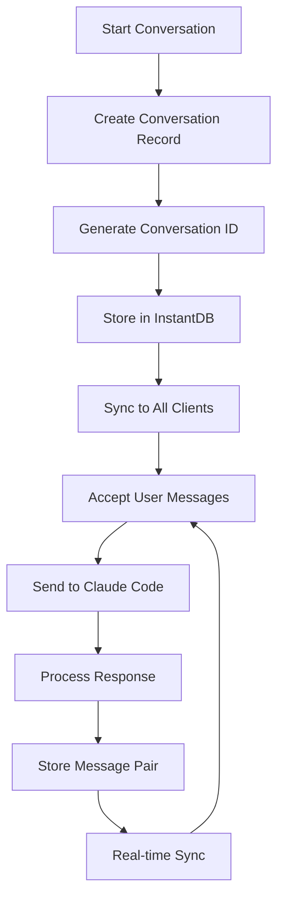
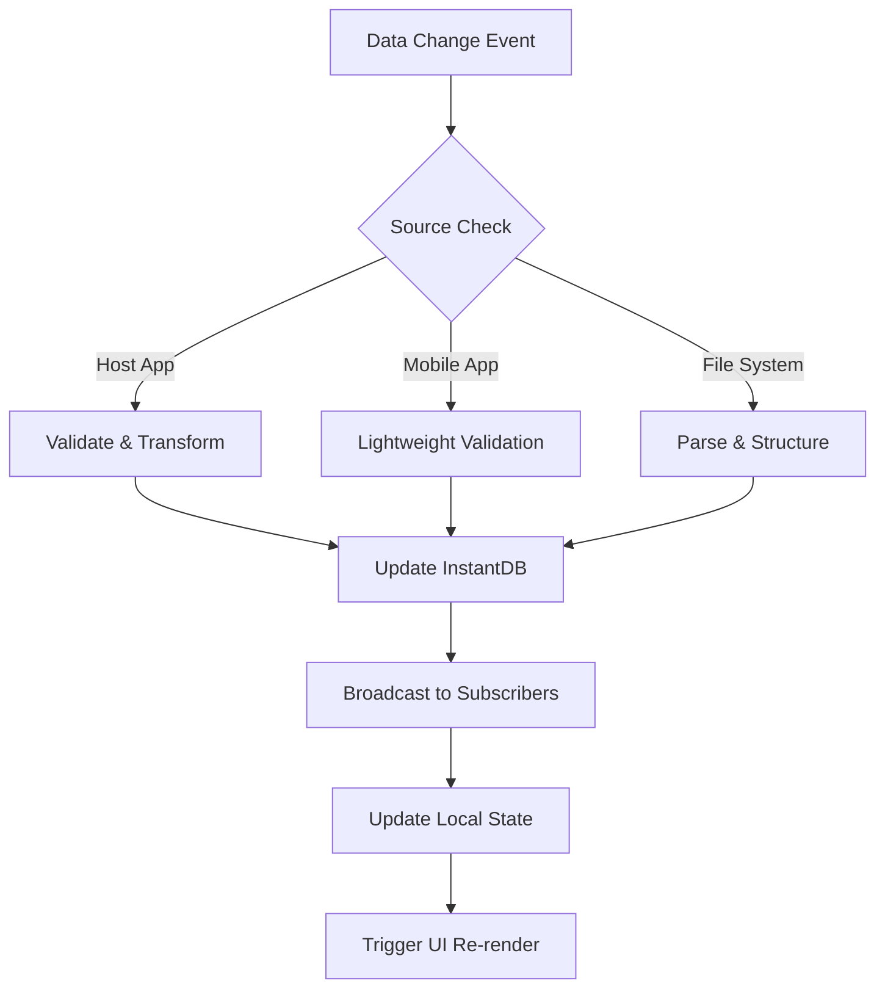
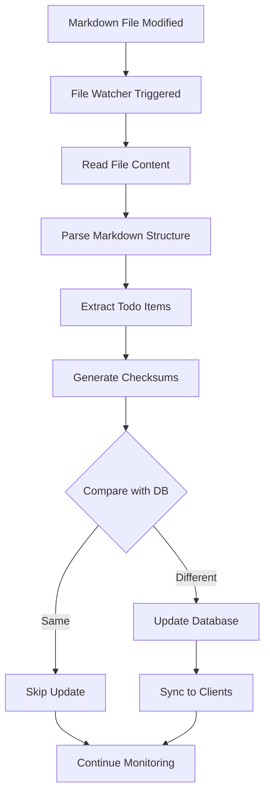

# Claude Code Remote Control - System Architecture & Workflows

## Overview

The Claude Code Remote Control system is designed as a real-time, multi-platform application that enables seamless communication with Claude Code while maintaining synchronized state across all connected devices. The architecture follows a distributed, event-driven pattern with InstantDB as the central synchronization layer.

## System Architecture

### High-Level Architecture

```
┌─────────────────┐    ┌─────────────────┐    ┌─────────────────┐
│   Host App      │    │   Mobile App    │    │   Web Client    │
│  (npx + TS)     │    │ (Expo + RN)     │    │  (Future)       │
└─────────┬───────┘    └─────────┬───────┘    └─────────┬───────┘
          │                      │                      │
          │              Real-time Sync Layer           │
          │              ┌─────────────────┐             │
          └──────────────┤   InstantDB     ├─────────────┘
                         │  (Database)     │
                         └─────────────────┘
                                 │
                         ┌─────────────────┐
                         │  Claude Code    │
                         │     SDK         │
                         └─────────────────┘
```

### Component Architecture

#### 1. Host Application (Primary Controller)
- **Technology**: Node runtime with TypeScript
- **Role**: Primary interface to Claude Code SDK on user's host
- **Responsibilities**:
  - Direct Claude Code API communication
  - Message processing and response handling
  - Real-time database updates
  - File system operations
  - Local task management

#### 2. Mobile Application (Remote Monitor)
- **Technology**: Expo with React Native
- **Role**: Real-time monitoring and light interaction
- **Responsibilities**:
  - Display live conversation streams
  - Remote command triggering
  - Push notifications
  - Offline conversation caching

#### 3. InstantDB (Synchronization Layer)
- **Technology**: InstantDB real-time database
- **Role**: Central state management and sync
- **Responsibilities**:
  - Real-time data synchronization
  - Conflict resolution
  - User authentication
  - Schema enforcement

## Data Flow Architecture

### 1. Message Flow (Host → Claude → Clients)

```
User Input (Host) → Host App → Claude Code SDK → Response
                      ↓                           ↓
                 InstantDB ←────────────── Process Response
                      ↓
            Mobile/Web Clients (Real-time Update)
```

### 2. Reverse Command Flow (Mobile → Host → Claude)

```
Mobile Command → InstantDB → Host App → Claude Code SDK
                                ↓
                        Process & Store Result
                                ↓
                          InstantDB Update
                                ↓
                        Mobile Confirmation
```

### 3. File Synchronization Flow

```
Markdown File Change → File Watcher → Parse & Extract
                                          ↓
                                    Validate Schema
                                          ↓
                                     InstantDB Update
                                          ↓
                                  Trigger Connected Clients
```

## Core Workflows

### 1. Conversation Management Workflow



### 2. Real-time Synchronization Workflow



### 3. Markdown-to-Database Sync Workflow



## Data Consistency Model

### 1. Eventually Consistent Model
- All clients will eventually see the same data
- Temporary inconsistencies are acceptable
- Conflict resolution favors latest timestamp
- Manual conflict resolution for complex cases

### 2. Optimistic Updates
- Mobile clients can make immediate UI updates
- Changes are validated on sync
- Rollback on validation failure
- User notification for conflicts

### 3. Schema Validation
- Strict typing at application boundaries
- Runtime validation for external data
- Schema evolution with backward compatibility
- Data migration strategies

## Security Architecture

### 1. Authentication Flow
```
Client Request → InstantDB Auth → JWT Token → API Access
                      ↓
              User Session Management
                      ↓
              Role-based Permissions
```

### 2. Data Encryption
- API keys encrypted at rest
- TLS for all network communication  
- Sensitive data encrypted in database
- Local storage encryption for mobile

### 3. Access Control
- User-based conversation isolation
- Device-based session management
- API rate limiting
- Audit logging for sensitive operations

## Performance Considerations

### 1. Real-time Updates
- WebSocket connections for live updates
- Connection pooling and reuse
- Automatic reconnection handling
- Batched updates for efficiency

### 2. Caching Strategy
- Local caching for offline support
- Smart cache invalidation
- Pre-loading of recent conversations
- Lazy loading for historical data

### 3. Resource Management
- Memory-efficient message storage
- File-based caching for large content
- Background processing for heavy operations
- Resource cleanup on session end

## Error Handling & Recovery

### 1. Network Failures
- Automatic retry with exponential backoff
- Offline queue for pending operations
- Graceful degradation of features
- User notification for extended outages

### 2. Data Conflicts
- Last-write-wins for simple conflicts
- Manual resolution UI for complex cases
- Conflict history tracking
- Rollback capabilities

### 3. System Failures
- Graceful shutdown procedures
- Data persistence during crashes
- Health check endpoints
- Automatic service recovery

## Development & Deployment Patterns

### 1. Development Workflow
```
Local Development → Schema Validation → Unit Tests
                                           ↓
                  Integration Testing → Staging Deploy
                                           ↓
                     Production Deploy → Monitoring
```

### 2. Database Migrations
- Schema versioning system
- Backward compatibility requirements
- Data migration scripts
- Rollback procedures

### 3. Feature Flags
- Gradual feature rollout
- A/B testing capabilities
- Emergency feature disabling
- Environment-based configuration

## Monitoring & Observability

### 1. Metrics Collection
- Real-time sync latency
- Message processing times
- Error rates and types
- User engagement metrics

### 2. Logging Strategy
- Structured logging with correlation IDs
- Different log levels per environment
- PII data protection
- Log retention policies

### 3. Alerting System
- Critical error notifications
- Performance threshold alerts
- Service health monitoring
- User impact tracking

## Future Architecture Considerations

### 1. Scalability
- Multi-region deployment
- Database sharding strategies
- CDN integration for static assets
- Load balancing for high traffic

### 2. Extensibility
- Plugin architecture for custom tools
- API gateway for third-party integrations
- Webhook system for external events
- Custom model integration

### 3. Advanced Features
- Voice input/output integration
- Multi-modal content support
- Collaborative editing features
- Advanced search and analytics

---

This architecture is designed to be resilient, scalable, and maintainable while providing a seamless user experience across all platforms and use cases.